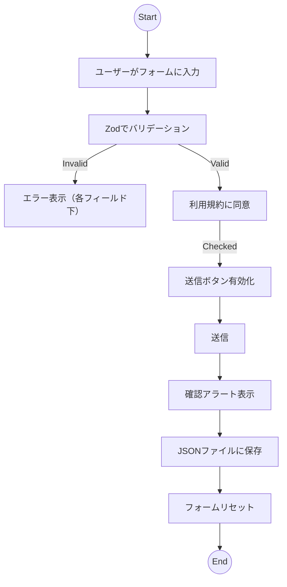

# Enquiry Form Plan (CRISP)

## Context

- This site is a Vue 3 + Vite demo, with Pinia, Vue Router, and TypeScript.
- The new page is a demo for an accessible, validated enquiry form.
- Read the full context in [Enquiry Form Context](./enquiry-form-context.md).

## Requirements

- WCAG AA accessibility compliance
- Form validation using Zod (to be added as a new dependency)
- Ensure mobile responsiveness
- Form fields (in Japanese, don't include labels in English):
  - 名前 (Name) - required, text
  - メールアドレス (Email Address) - required, email format
  - 電話番号 (Phone Number) - optional, phone format
  - お問い合わせ内容 (Enquiry Content) - required, textarea
  - 添付ファイル (Attachment) - optional, file upload (PDF, JPG, PNG; max 5MB)
  - A section for ToS (scrollable within a fixed-height box), then a required checkbox for agreement (for the ToS text, use placeholder lorem ipsum in Japanese)
- Required fields are marked clearly with a red label.
- There should be slots for displaying validation error messages below each field.
- Submit button disabled until all required fields are valid and ToS is agreed.
- On submission, show a confirmation alert with entered details (except file). Then reset the form.
- Submitted data are saved to a JSON file for demo purposes and possible future use.
- Discard file uploads, keep the file name and size only.

## Instructions

- Create a new view: `src/views/EnquiryFormView.vue`
- Add route: `/enquiry-form` in `src/router/index.ts`
- Create form component: `src/components/EnquiryForm.vue`
- If the form is split into subcomponents (e.g., file upload, ToS box), create them in `src/components/` and import into `EnquiryForm.vue`
- Use Zod for validation (add to `package.json` if missing)
- Save submitted data to a JSON file in `public/` for demo purposes
- Use ARIA attributes and roles for all interactive elements
- Use TailwindCSS or scoped CSS for styling and responsiveness
- Use the site's CSS variables for color and background
- Ensure WCAG AA compliance (labels, ARIA, keyboard navigation, color contrast)
- Add unit tests for validation and accessibility
- Document usage in README
- Auto-focus the first invalid field on submit
- Use browser alert for confirmation
- Error messages: clear, concise, in Japanese
- Minimal, clean design; no animation or transition required

## Scope

- Only the enquiry form page and related components
- No backend integration unless specified
- Demo-level implementation

## Preferences

- Use Composition API and TypeScript
- Follow existing code style and linting rules
- Use `@/` alias for imports
- Place tests in `src/components/__tests__/`
- [Comment for user: Any preferences for UI style, layout, or additional features?]

---

<!-- Please fill in the comments above to clarify requirements. -->

### Clarifications Needed

- Please specify any preferred UI style (e.g., minimal, material, etc.), color scheme, or branding.
  - None specified; proceed with a clean, minimal design.
- Should the ToS checkbox be required before any field is filled, or only before submission?
  - Only before submission.
- Should the confirmation alert be modal, toast, or browser alert?
  - Browser alert.
- Where should the saved JSON file be stored (localStorage, download, or in `public/`)?
  - In `public/` for demo purposes.
- Any specific error message wording or format?
  - No, just use clear, concise messages in Japanese.
- Should the form auto-focus the first invalid field on submit?
  - Yes, to improve accessibility and user experience.
- Any animation or transition preferences?
  - No specific preferences; keep it simple.
- Should the form support dark mode?
  - I reckon the repo itself is in dark mode, but check again before proceeding. Follow the existing site style (if there are both modes, implement both).

### Updated Instructions

- If the form is split into subcomponents (e.g., file upload, ToS box), create them in `src/components/` and import into `EnquiryForm.vue`.
- Add Zod to `package.json` if missing.
- Save submitted data to a JSON file (see clarification above).
- Use ARIA attributes and roles for all interactive elements.
- Use TailwindCSS or scoped CSS for styling and responsiveness.
- Use the site's CSS variables for color and background.
- Ensure WCAG AA compliance (labels, ARIA, keyboard navigation, color contrast).
- Add unit tests for validation and accessibility.
- Document usage in README.
- Auto-focus the first invalid field on submit.
- Use browser alert for confirmation.
- Error messages: clear, concise, in Japanese.
- Minimal, clean design; no animation or transition required.

## Scope

- Only the enquiry form page and related components
- No backend integration unless specified
- Demo-level implementation

## Preferences

- Use Composition API and TypeScript
- Follow existing code style and linting rules
- Use `@/` alias for imports
- Place tests in `src/components/__tests__/`
- [Comment for user: Any preferences for UI style, layout, or additional features?]

---

<!-- Please fill in the comments above to clarify requirements. -->

### Clarifications Needed

- Please specify any preferred UI style (e.g., minimal, material, etc.), color scheme, or branding.
  - None specified; proceed with a clean, minimal design.
- Should the ToS checkbox be required before any field is filled, or only before submission?
  - Only before submission.
- Should the confirmation alert be modal, toast, or browser alert?
  - Browser alert.
- Where should the saved JSON file be stored (localStorage, download, or in `public/`)?
  - In `public/` for demo purposes.
- Any specific error message wording or format?
  - No, just use clear, concise messages in Japanese.
- Should the form auto-focus the first invalid field on submit?
  - Yes, to improve accessibility and user experience.
- Any animation or transition preferences?
  - No specific preferences; keep it simple.
- Should the form support dark mode?
  - I reckon the repo itself is in dark mode, but check again before proceeding. Follow the existing site style (if there are both modes, implement both).

### Updated Instructions

- If the form is split into subcomponents (e.g., file upload, ToS box), create them in `src/components/` and import into `EnquiryForm.vue`.
- Add Zod to `package.json` if missing.
- Save submitted data to a JSON file (see clarification above).
- Use ARIA attributes and roles for all interactive elements.
- Use TailwindCSS or scoped CSS for styling and responsiveness.
- Use the site's CSS variables for color and background.
- Ensure WCAG AA compliance (labels, ARIA, keyboard navigation, color contrast).
- Add unit tests for validation and accessibility.
- Document usage in README.
- Auto-focus the first invalid field on submit.
- Use browser alert for confirmation.
- Error messages: clear, concise, in Japanese.
- Minimal, clean design; no animation or transition required.

## Detailed Design & Flow

### User Flow (Mermaid)

### Components & Purposes

- `EnquiryFormView.vue`: Page wrapper, provides layout and meta info.
- `EnquiryForm.vue`: Main form logic, state, validation, handles submit.
- (Optional) `FileUpload.vue`: Handles file input, validation, and displays file info.
- (Optional) `ToSBox.vue`: Scrollable ToS text and agreement checkbox.

### Component Logic

- **State:** Use `ref`/`reactive` for form fields, errors, ToS agreement, file info.
- **Validation:** Zod schema for all fields, run on change and submit.
- **Methods:**
  - `handleInputChange`: Update field, re-validate.
  - `handleFileChange`: Validate file type/size, store name/size only.
  - `handleToSChange`: Track agreement.
  - `handleSubmit`: Validate all, show confirmation, save data, reset.
- **Watchers:**
  - Watch form fields and ToS for validation and enabling submit.
- **Accessibility:**
  - Use `aria-label`, `aria-required`, `aria-invalid`, `aria-describedby` for errors.
  - Keyboard navigation: Tab order, focus management, Enter to submit.
  - Color contrast: Red for required, error messages, sufficient contrast for all elements.
  - ToS box: Scrollable, focusable, with clear label.
- **Responsiveness:**
  - Use flex/grid for layout, media queries for mobile.
  - Inputs and buttons scale for touch.
- **Validation Details:**
  - Name: required, non-empty
  - Email: required, valid email
  - Phone: optional, valid phone (regex)
  - Enquiry: required, min length
  - File: optional, PDF/JPG/PNG, max 5MB, store name/size only
  - ToS: required checkbox
  - Show errors below each field
  - Disable submit until all valid

### Component Interaction

- `EnquiryFormView` renders `EnquiryForm`.
- `EnquiryForm` may use `FileUpload` and `ToSBox` as child components.
- Parent passes props, child emits events for changes.

### UI/UX Design Specs

- Minimal, clean layout, Japanese labels only.
- Required fields marked in red.
- Error messages in red, below fields.
- Submit button visually disabled until valid.
- ToS box: fixed height, scrollable, clear checkbox.
- Responsive: single column on mobile, multi-column on desktop.
- Confirmation: modal or alert (clarify preference).

### Accessibility, Responsiveness, Validation

- All fields have labels, ARIA attributes, and keyboard support.
- Color contrast meets WCAG AA.
- Responsive layout for mobile/desktop.
- Zod validation for all fields, errors shown inline.

### Testing

- Unit tests for:
  - Validation logic (Zod)
  - Error display
  - Accessibility (labels, ARIA, keyboard)
  - Responsiveness (mobile/desktop)
  - Submit flow and reset
  - File upload validation
  - ToS agreement logic

#### Dark/Light Mode Support

- The current site does not implement a dark/light mode switch, but uses CSS variables for colors (e.g., `var(--color-text)`, `var(--color-background)`).
- For the enquiry form, use these variables for color and background to match the site style.
- If dark mode is desired, extend the CSS variables and document how to add theme switching in the future.

### Final Instructions (Merged)

- Create a new view: `src/views/EnquiryFormView.vue`.
- Add route: `/enquiry-form` in `src/router/index.ts`.
- Create form component: `src/components/EnquiryForm.vue`.
- If the form is split into subcomponents (e.g., file upload, ToS box), create them in `src/components/` and import into `EnquiryForm.vue`.
- Use Zod for validation (add to `package.json` if missing).
- Save submitted data to a JSON file in `public/` for demo purposes.
- Use ARIA attributes and roles for all interactive elements.
- Use TailwindCSS or scoped CSS for styling and responsiveness.
- Use the site's CSS variables for color and background.
- Ensure WCAG AA compliance (labels, ARIA, keyboard navigation, color contrast).
- Add unit tests for validation and accessibility.
- Document usage in README.
- Auto-focus the first invalid field on submit.
- Use browser alert for confirmation.
- Error messages: clear, concise, in Japanese.
- Minimal, clean design; no animation or transition required.
