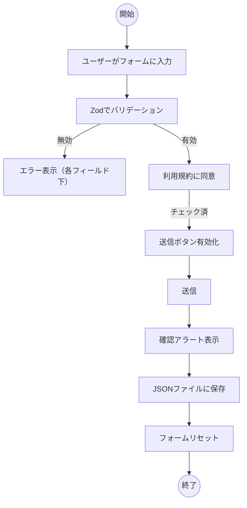

# 問い合わせフォーム計画（CRISP）

## コンテキスト

- このサイトはVue 3 + Viteデモで、Pinia、Vue Router、TypeScriptを使用。
- 新ページはアクセシブルかつバリデーション済みの問い合わせフォームのデモ。
- 詳細は[コンテキストファイル](./enquiry-form-context-ja.md)参照。

## 要件

- WCAG AAアクセシビリティ準拠
- Zodによるフォームバリデーション（新規依存追加）
- モバイル対応
- フォーム項目（日本語のみ、英語ラベル不要）：
  - 名前（必須、テキスト）
  - メールアドレス（必須、メール形式）
  - 電話番号（任意、電話番号形式）
  - お問い合わせ内容（必須、テキストエリア）
  - 添付ファイル（任意、PDF/JPG/PNG、最大5MB）
  - 利用規約（固定高さスクロールボックス）、同意必須チェックボックス（ダミー日本語テキスト）
- 必須項目は赤ラベルで明示
- 各項目下にバリデーションエラーメッセージ表示
- すべて有効かつToS同意で送信ボタン有効化
- 送信時、入力内容（ファイル除く）を確認アラート表示後、フォームリセット
- 送信データはlocalStorageに配列で保存。全件をJSON（`enquiries.json`）でダウンロード可能ボタン設置
- ファイルアップロードは破棄、ファイル名とサイズのみ保持

## 実装手順

- 新規ビュー：`src/views/EnquiryFormView.vue`作成
- ルート追加：`src/router/index.ts`に`/enquiry-form`
- フォームコンポーネント：`src/components/EnquiryForm.vue`作成
- Zod導入（`package.json`に追加）
- 送信データはlocalStorage配列保存、全件JSONダウンロードボタン設置
- すべてのインタラクティブ要素にARIA属性・ロール付与
- TailwindCSSまたはscoped CSSでスタイリング・レスポンシブ対応
- サイトのCSS変数で色・背景指定
- WCAG AA準拠（ラベル、ARIA、キーボード、コントラスト）
- バリデーション・アクセシビリティのユニットテスト追加
- READMEに使用方法記載
- 送信時、最初の無効項目に自動フォーカス
- 確認はブラウザアラート
- エラーメッセージは日本語で明確・簡潔
- ミニマル・クリーンデザイン、アニメ・トランジション不要

## スコープ

- 問い合わせフォームページと関連コンポーネントのみ
- バックエンド連携なし（指定時のみ）
- デモレベル実装
- サブコンポーネント（FileUpload, ToSBox）は不要。全ロジックはEnquiryForm.vue内で実装。

## プリファレンス

- Composition APIとTypeScript使用
- 既存コードスタイル・リントルール遵守
- インポートは`@/`エイリアス使用
- テストは`src/components/__tests__/`に配置
- [コメント：UIスタイル・レイアウト・追加機能の希望があれば記入]

---

<!-- 上記コメント欄に要件を明確化してください -->

### 明確化事項

- UIスタイル・配色・ブランディングの希望は？
  - 指定なし、ミニマル・クリーンデザインで進行
- ToSチェックは項目入力前必須？送信前のみ？
  - 送信前のみ必須
- 確認アラートはモーダル・トースト・ブラウザアラート？
  - ブラウザアラート
- 保存JSONはlocalStorage・ダウンロード・`public/`？
  - デモ用に`public/`、localStorage。全件ダウンロードボタン設置
- エラーメッセージの文言・形式指定は？
  - 指定なし、日本語で明確・簡潔
- 送信時、最初の無効項目自動フォーカス？
  - はい、アクセシビリティ・UX向上
- アニメ・トランジション希望は？
  - 指定なし、シンプル
- ダークモード対応は？
  - サイトがダークモードなら従う。両対応なら両方実装。

### 実装手順（更新）

- サブコンポーネント分割時は`src/components/`に作成しEnquiryForm.vueでインポート
- Zod導入（`package.json`に追加）
- 送信データはlocalStorage配列保存、全件JSONダウンロードボタン設置
- すべてのインタラクティブ要素にARIA属性・ロール付与
- TailwindCSSまたはscoped CSSでスタイリング・レスポンシブ対応
- サイトのCSS変数で色・背景指定
- WCAG AA準拠（ラベル、ARIA、キーボード、コントラスト）
- バリデーション・アクセシビリティのユニットテスト追加
- READMEに使用方法記載
- 送信時、最初の無効項目に自動フォーカス
- 確認はブラウザアラート
- エラーメッセージは日本語で明確・簡潔
- ミニマル・クリーンデザイン、アニメ・トランジション不要

## 詳細設計・フロー

### ユーザーフロー（Mermaid）

### コンポーネントと目的

- `EnquiryFormView.vue`：ページラッパー、レイアウト・メタ情報
- `EnquiryForm.vue`：メインフォームロジック、状態・バリデーション・送信処理
- （任意）`FileUpload.vue`：ファイル入力・バリデーション・ファイル情報表示
- （任意）`ToSBox.vue`：利用規約テキスト・同意チェックボックス

### コンポーネントロジック

- **状態管理：** `ref`/`reactive`でフォーム項目・エラー・ToS同意・ファイル情報管理
- **バリデーション：** Zodスキーマで全項目、変更・送信時に実行
- **メソッド：**
  - `handleInputChange`：項目更新・再バリデーション
  - `handleFileChange`：ファイル型・サイズバリデーション、名前・サイズのみ保持
  - `handleToSChange`：同意状況管理
  - `handleSubmit`：全項目バリデーション、確認表示、保存、リセット
- **ウォッチャー：**
  - 項目・ToS変更時にバリデーション・送信有効化
- **アクセシビリティ：**
  - `aria-label`、`aria-required`、`aria-invalid`、`aria-describedby`でエラー管理
  - キーボード操作：Tab順・フォーカス管理・Enter送信
  - 色コントラスト：必須・エラーは赤、全要素十分なコントラスト
  - ToSボックス：スクロール・フォーカス可能・明確なラベル
- **レスポンシブ：**
  - Flex/Gridレイアウト、モバイル用メディアクエリ
  - 入力・ボタンはタッチ対応
- **バリデーション詳細：**
  - 名前：必須、空不可
  - メール：必須、メール形式
  - 電話：任意、正規表現
  - お問い合わせ：必須、最小文字数
  - ファイル：任意、PDF/JPG/PNG、最大5MB、名前・サイズのみ
  - ToS：必須チェック
  - 各項目下にエラー表示
  - 全項目有効で送信有効化

### コンポーネント相互作用

- `EnquiryFormView`が`EnquiryForm`をレンダリング
- `EnquiryForm`は必要に応じて`FileUpload`・`ToSBox`を子コンポーネントとして使用
- 親はprops渡し、子はイベントで変更通知

### UI/UX設計仕様

- ミニマル・クリーンレイアウト、日本語ラベルのみ
- 必須項目は赤で明示
- エラーは赤、項目下に表示
- 送信ボタンは有効時のみ視覚的に有効化
- ToSボックス：固定高さ・スクロール・明確なチェックボックス
- レスポンシブ：モバイルは1カラム、デスクトップは複数カラム
- 確認：モーダルまたはアラート（要希望確認）

### アクセシビリティ・レスポンシブ・バリデーション

- 全項目にラベル・ARIA属性・キーボード対応
- 色コントラストはWCAG AA準拠
- モバイル/デスクトップ対応レイアウト
- Zodバリデーション、エラーはインライン表示

### テスト

- ユニットテスト：
  - バリデーションロジック（Zod）
  - エラー表示
  - アクセシビリティ（ラベル・ARIA・キーボード）
  - レスポンシブ（モバイル/デスクトップ）
  - 送信・リセットフロー
  - ファイルアップロードバリデーション
  - ToS同意ロジック

#### ダーク/ライトモード対応

- サイトはダーク/ライトモード切替未実装だが、CSS変数（`var(--color-text)`、`var(--color-background)`等）使用
- 問い合わせフォームもこれら変数で色・背景指定し、サイトスタイルに合わせる
- ダークモード希望時はCSS変数拡張・テーマ切替方法をドキュメント化

### 最終手順（統合）

- 新規ビュー：`src/views/EnquiryFormView.vue`作成
- ルート追加：`src/router/index.ts`に`/enquiry-form`
- フォームコンポーネント：`src/components/EnquiryForm.vue`作成
- Zod導入（`package.json`に追加）
- 送信データはlocalStorage配列保存、全件JSONダウンロードボタン設置
- すべてのインタラクティブ要素にARIA属性・ロール付与
- TailwindCSSまたはscoped CSSでスタイリング・レスポンシブ対応
- サイトのCSS変数で色・背景指定
- WCAG AA準拠（ラベル、ARIA、キーボード、コントラスト）
- バリデーション・アクセシビリティのユニットテスト追加
- READMEに使用方法記載
- 送信時、最初の無効項目に自動フォーカス
- 確認はブラウザアラート
- エラーメッセージは日本語で明確・簡潔
- ミニマル・クリーンデザイン、アニメ・トランジション不要
